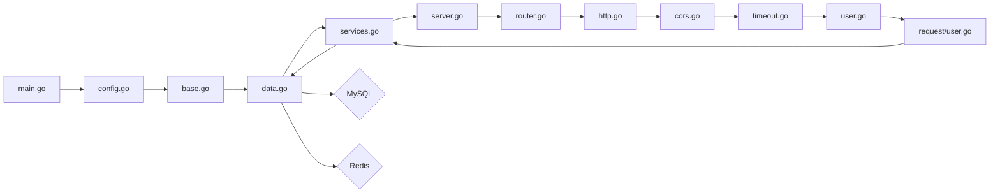

authset 目前尚处开闭源开发中

<!-- more -->

## 第三方登录鉴权

### 微信

微信网站应用登录功能参考文档：https://developers.weixin.qq.com/doc/oplatform/Website_App/WeChat_Login/Wechat_Login.html

授权流程说明：微信OAuth2.0授权登录让微信用户使用微信身份安全登录第三方应用或网站，在微信用户授权登录已接入微信OAuth2.0的第三方应用后，第三方可以获取到用户的接口调用凭证（access_token），通过access_token可以进行微信开放平台授权关系接口调用，从而可实现获取微信用户基本开放信息和帮助用户实现基础开放功能等。 微信OAuth2.0授权登录目前支持authorization_code模式，适用于拥有server端的应用授权。

该模式整体流程为：
1. 第三方发起微信授权登录请求，微信用户允许授权第三方应用后，微信会拉起应用或重定向到第三方网站，并且带上授权临时票据code参数；
2. 通过code参数加上AppID和AppSecret等，通过API换取access_token；
3. 通过access_token进行接口调用，获取用户基本数据资源或帮助用户实现基本操作。

```go
package oauth

import (
	"context"
	"encoding/base64"
	"fmt"
	"strings"
	"time"

	"github.com/go-resty/resty/v2"
	"github.com/skip2/go-qrcode"
	"golang.org/x/oauth2"
)

type WeChat struct {
	// 一个 *resty.Client 类型的指针，表示一个HTTP客户端实例，可以用来发送请求和接收响应
	Client *resty.Client
	// 一个 *oauth2.Config 类型的指针，表示一个OAuth2.0配置实例，包含了授权服务器的地址、客户端ID、客户端密钥、重定向URI、授权范围等信息
	Config *oauth2.Config
}

// NewWeChat 函数，用于创建一个WeChat结构体的实例
// clientId: 是一个string类型的值，表示微信的客户端ID，用于标识应用的身份。
// clientSecret: 是一个string类型的值，表示微信的客户端密钥，用于验证应用的合法性。
// redirectUrl: 是一个string类型的值，表示微信的重定向URI，用于接收授权码和跳转回应用。
func NewWeChat(clientId string, clientSecret string, redirectUrl string) *WeChat {
	// 创建一个WeChat结构体的实例
	idp := &WeChat{}
	// 调用getConfig函数，创建一个 *oauth2.Config 类型的指针，表示一个OAuth2.0配置实例，包含了授权服务器的地址、客户端ID、客户端密钥、重定向URI、授权范围等信息
	config := idp.getConfig(clientId, clientSecret, redirectUrl)
	// 将config赋值给idp.Config，也就是将OAuth2.0配置实例赋值给WeChat结构体的Config字段
	idp.Config = config

	return idp
}

//func (idp *WeChat) SetHttpClient(client *resty.Client) {
//	idp.Client = client
//}

// SetClient 方法，用于设置WeChat结构体的Client字段
func (idp *WeChat) SetClient(client *resty.Client) {
	// 将传入的client赋值给idp的Client字段，表示将HTTP客户端实例保存到WeChat结构体中
	idp.Client = client
}

func (w *WeChat) getConfig(clientId string, clientSecret string, redirectUrl string) *oauth2.Config {
	// 创建一个oauth2.Endpoint类型的变量，表示一个OAuth2.0的授权服务器地址
	endpoint := oauth2.Endpoint{
		TokenURL: "https://graph.qq.com/oauth2.0/token",
	}

	config := &oauth2.Config{
		Scopes:       []string{"snsapi_login"},
		Endpoint:     endpoint,
		ClientID:     clientId,
		ClientSecret: clientSecret,
		RedirectURL:  redirectUrl,
	}

	return config
}

type WechatAccessToken struct {
	AccessToken  string `json:"access_token"`
	ExpiresIn    int64  `json:"expires_in"`
	RefreshToken string `json:"refresh_token"`
	Openid       string `json:"openid"`
	Scope        string `json:"scope"`
	Unionid      string `json:"unionid"`
}

func (w *WeChat) GetToken(ctx context.Context, code string) (*oauth2.Token, error) {
	var wechatAccessToken WechatAccessToken
	resp, err := w.Client.R().SetContext(ctx).
		SetQueryParams(map[string]string{
			"grant_type": "authorization_code",
			"appid":      w.Config.ClientID,
			"secret":     w.Config.ClientSecret,
			"code":       code,
		}).
		SetResult(&wechatAccessToken).
		Get(`https://api.weixin.qq.com/sns/oauth2/access_token`)
	if err != nil {
		return nil, err
	}

	if strings.Contains(resp.String(), "errcode") {
		return nil, fmt.Errorf(resp.String())
	}

	token := oauth2.Token{
		AccessToken:  wechatAccessToken.AccessToken,
		TokenType:    "WeChatAccessToken",
		RefreshToken: wechatAccessToken.RefreshToken,
		Expiry:       time.Time{},
	}

	raw := map[string]string{
		"Openid": wechatAccessToken.Openid,
	}
	token.WithExtra(raw)

	return &token, nil
}

type WechatUserInfo struct {
	Openid     string   `json:"openid"`
	Nickname   string   `json:"nickname"`
	Sex        int      `json:"sex"`
	Language   string   `json:"language"`
	City       string   `json:"city"`
	Province   string   `json:"province"`
	Country    string   `json:"country"`
	Headimgurl string   `json:"headimgurl"`
	Privilege  []string `json:"privilege"`
	Unionid    string   `json:"unionid"`
}

func (w *WeChat) GetUserInfo(ctx context.Context, token *oauth2.Token) (*UserInfo, error) {
	accessToken := token.AccessToken
	openid := token.Extra("Openid")

	var wechatUserInfo WechatUserInfo
	_, err := w.Client.R().SetContext(ctx).
		SetQueryParams(map[string]string{
			"access_token": accessToken,
			"openid":       openid.(string),
		}).
		SetResult(&wechatUserInfo).
		Get("https://api.weixin.qq.com/sns/userinfo")
	if err != nil {
		return nil, err
	}

	id := wechatUserInfo.Unionid
	if id == "" {
		id = wechatUserInfo.Openid
	}

	return &UserInfo{
		Id:          id,
		Username:    wechatUserInfo.Nickname,
		DisplayName: wechatUserInfo.Nickname,
		AvatarUrl:   wechatUserInfo.Headimgurl,
	}, nil
}

func (w *WeChat) GetWechatOfficialAccountAccessToken(ctx context.Context, clientId string, clientSecret string) (string, error) {
	var data struct {
		ExpireIn    int    `json:"expires_in"`
		AccessToken string `json:"access_token"`
	}

	_, err := w.Client.R().SetContext(ctx).
		SetQueryParams(map[string]string{
			"appid":  clientId,
			"secret": clientSecret,
		}).
		SetResult(&data).
		Get(`https://api.weixin.qq.com/cgi-bin/token?grant_type=client_credential`)
	if err != nil {
		return "", err
	}

	return data.AccessToken, nil
}

func (w *WeChat) GetWechatOfficialAccountQRCode(ctx context.Context, clientId string, clientSecret string) (string, error) {
	accessToken, err := w.GetWechatOfficialAccountAccessToken(ctx, clientId, clientSecret)
	if err != nil {
		return "", err
	}

	var data struct {
		Ticket        string `json:"ticket"`
		ExpireSeconds int    `json:"expire_seconds"`
		URL           string `json:"url"`
	}

	_, err = w.Client.R().SetContext(ctx).
		SetBody(`{
			"action_name": "QR_LIMIT_STR_SCENE",
			"action_info": { "scene": { "scene_str": "test" } }
		}`).
		SetPathParam("access_token", accessToken).
		SetBody(&data).
		Post(`https://api.weixin.qq.com/cgi-bin/qrcode/create?access_token`)
	if err != nil {
		return "", err
	}

	var png []byte
	png, err = qrcode.Encode(data.URL, qrcode.Medium, 256)
	if err != nil {
		return "", err
	}

	base64Image := base64.StdEncoding.EncodeToString(png)
	return base64Image, nil
}
```


### QQ

### Google

文档：https://developers.google.com/identity/protocols/oauth2/web-server?hl=zh-cn#obtainingaccesstokens

## 搭建项目框架

本项目使用 Go语言：一种编译型、并发型、垃圾回收型、面向对象的编程语言，具有简洁、高效、可靠等特点。主要使用的技术栈有：

- gin框架：一种基于Go语言的轻量级、高性能、支持中间件的Web框架，具有快速、灵活、易用等特点。
- http包：Go语言标准库中的一个包，提供了创建和处理HTTP协议的客户端和服务器端的功能。

```bash
authset
├── api
│   └── v1
│       ├── api.go
│       └── user.go
├── config
│   ├── config.go
│   ├── http.go
│   ├── mysql.go
│   └── redis.go
├── config.yaml
├── data
│   ├── base.go
│   ├── data.go
│   └── user.go
├── go.mod
├── go.sum
├── main.go
├── middlewares
│   ├── cors.go
│   └── timeout.go
├── request
│   └── user.go
├── router
│   ├── router.go
│   └── user.go
├── server
│   ├── http.go
│   └── server.go
├── services
│   ├── services.go
│   └── user.go
├── wire.go
└── wire_gen.go
```
我会尽力根据目录树说明该程序的执行调用顺序。一般来说，程序的执行调用顺序是这样的：程序会执行`main.go`文件中的main函数，这是程序的入口点。然后，main函数会调用config目录中的config.go文件中的InitConfig函数，加载配置文件并初始化配置结构体。接着，main函数会调用data目录中的base.go文件中的InitDB和InitRedis函数，初始化数据库和缓存连接池，并赋值给data目录中的data.go文件中的全局数据层实例变量Data。然后，main函数会调用services目录中的services.go文件中的NewService函数，创建一个服务层实例，并赋值给server目录中的server.go文件中的全局服务实例变量Server。接着，main函数会调用router目录中的router.go文件中的NewRouter函数，创建一个路由引擎，并注册中间件、路由组、路由规则等。然后，main函数会调用server目录中的http.go文件中的NewHTTPServer函数，创建一个HTTP服务实例，并传入路由引擎和配置信息。接着，main函数会调用HTTP服务实例的Start方法，启动HTTP服务，并监听端口和处理请求。


然后，当客户端发送请求到服务器时，请求会经过以下几个步骤：首先，请求会被跨域资源共享（CORS）中间件处理，检查请求是否符合跨域访问规则，如果不符合则返回错误响应，如果符合则继续下一步。然后，请求会被超时中间件处理，设置请求处理的最大时间，如果超过则返回错误响应，如果没有超过则继续下一步。接着，请求会被路由引擎匹配到对应的路由规则和处理器函数，比如用户相关路由规则和处理器函数在router目录中的user.go文件中定义。然后，处理器函数会从请求中获取参数，并调用request目录中对应参数结构体的验证方法，验证参数是否合法，如果不合法则返回错误响应，如果合法则继续下一步。接着，处理器函数会调用服务层实例的对应业务逻辑方法，比如用户相关业务逻辑方法在services目录中的user.go文件中定义。然后，业务逻辑方法会调用数据层实例的对应数据操作方法，比如用户相关数据操作方法在data目录中的user.go文件中定义。接着，数据操作方法会使用数据库或缓存连接池执行相应的SQL语句或缓存命令，并返回结果或错误。然后，业务逻辑方法会根据数据操作方法返回的结果或错误进行相应的处理，并返回结果或错误。接着，处理器函数会根据业务逻辑方法返回的结果或错误进行相应的处理，并返回响应给客户端。


- **api** 目录是用来定义API接口的，包含了v1版本的API文件。
  - **api.go**文件是用来定义通用的API响应结构和错误码的。
  - **user.go**文件是用来定义用户相关的API接口和参数验证的，比如注册、登录、登出等。
- **config** 目录是用来存放配置信息的，包含了config.go文件和各种配置项的文件。
  - **config.go**文件是用来加载配置文件和初始化配置结构体的。
  - **http.go**文件是用来定义HTTP服务的配置项的，比如端口、超时时间等。
  - **mysql.go**文件是用来定义MySQL数据库的配置项的，比如地址、用户名、密码等。
  - **redis.go**文件是用来定义Redis缓存的配置项的，比如地址、密码、数据库等。
- **config.yaml**文件是用来存放具体的配置值的，比如开发环境和生产环境的不同配置。
- **data** 目录是用来操作数据库和缓存的，包含了base.go文件和各种数据模型的文件。
  - **base.go**文件是用来初始化数据库和缓存连接池的，以及提供一些通用的数据操作方法的。
  - **data.go**文件是用来定义数据层接口和错误类型的，以及提供一个全局的数据层实例的。
  - **user.go**文件是用来实现用户数据模型和数据层接口的，比如创建用户、查询用户、更新用户等。
- **go.mod**和**go.sum**文件是用来管理项目依赖包的，记录了项目使用了哪些第三方库和版本号。
- **main.go** 文件是项目的入口文件，负责初始化配置、数据层、服务层、中间件、路由等，并启动HTTP服务。
- **middlewares** 目录是用来定义中间件的，包含了cors.go文件和timeout.go文件。
  - **cors.go**文件是用来定义跨域资源共享（CORS）中间件的，允许客户端跨域访问API接口。
  - **timeout.go**文件是用来定义超时中间件的，设置每个请求处理的最大时间，超过则返回错误响应。
- **request** 目录是用来定义请求参数结构体的，包含了user.go文件。
  - **user.go**文件是用来定义用户相关请求参数结构体的，比如注册参数、登录参数等，并实现参数验证方法。
- **router**目录是用来定义路由规则和处理器函数的，包含了router.go文件和各种路由模块文件。
  - **router.go**文件是用来初始化路由引擎和注册中间件、路由组、路由规则等的。
  - **user.go**文件是用来定义用户相关路由规则和处理器函数的，比如注册路由、登录路由等，并调用服务层方法处理业务逻辑。
- **server**目录是用来封装HTTP服务相关逻辑的，包含了http.go文件和server.go文件。
  - **http.go**文件是用来定义HTTP服务结构体和方法的，比如创建HTTP服务、启动HTTP服务、关闭HTTP服务等，并实现优雅地关闭HTTP服务功能。
  - **server.go**文件是用来定义服务接口和错误类型的，并提供一个全局服务实例变量。
- **services**目录是用来实现业务逻辑层的，包含了services.go文件和各种业务模块文件。
  - **services.go**文件是用来实现服务接口和提供一些通用服务方法的，比如生成JWT令牌、验证JWT令牌等。
  - **user.go**文件是用来实现用户相关业务逻辑层方法的，比如注册用户、登录用户、登出用户等，并调用数据层方法操作数据库或缓存。
- **wire.go**和**wire_gen.go**文件是使用wire库生成依赖注入代码的源码和输出码。wire库可以帮助我们自动地将各个组件连接起来，避免手动地写初始化代码。


这段代码定义了一个名为newApp的函数，该函数接受两个参数：engine和conf。engine是一个gin.Engine类型的指针，它是一个用于创建HTTP路由和中间件的框架。conf是一个config.Server类型的指针，它是一个用于存储服务器配置的结构体。

函数的返回值是一个*http.Server类型的指针，它是一个用于创建HTTP服务器的结构体。函数的主要作用是根据给定的engine和conf创建一个HTTP服务器，并返回它。

```go
// newApp 函数，用于创建一个HTTP服务器
func newApp(engine *gin.Engine, conf *config.Server) *http.Server {
	// 创建一个*http.Server类型的指针，命名为srv
	srv := &http.Server{
		// 设置srv的Addr字段为conf中的HTTP端口
		Addr: conf.HTTP.Port,
		// 设置srv的Handler字段为engine，即使用gin框架处理HTTP请求
		Handler: engine,
	}
	// 返回srv
	return srv
}
```

这段代码对整体项目的影响主要有：

- 它提供了一个统一的入口函数，方便在其他地方调用和创建HTTP服务器。
- 它实现了对gin框架和服务器配置的封装，简化了HTTP服务器的创建过程。
- 它增加了项目的可读性和可维护性，因为它使用了清晰的命名和注释。

```go
package main

import (
	"flag"
	"log"
	"net/http"

	"authset/config"
	"github.com/gin-gonic/gin"
	"github.com/spf13/viper"
	"go.uber.org/zap"
)

// newApp 函数，用于创建一个HTTP服务器
func newApp(engine *gin.Engine, conf *config.Server) *http.Server {
	// 创建一个*http.Server类型的指针，命名为srv
	srv := &http.Server{
		// 设置srv的Addr字段为conf中的HTTP端口
		Addr: conf.HTTP.Port,
		// 设置srv的Handler字段为engine，即使用gin框架处理HTTP请求
		Handler: engine,
	}
	// 返回srv
	return srv
}

func main() {
	// 读取 yaml 配置文件
	// 定义一个字符串变量path，用于存储配置文件的路径
	var path string
	// 使用flag包提供的函数，从命令行参数中获取配置文件的路径，并赋值给path变量
	// 如果没有指定-c选项，则使用默认值"./config.yaml"
	flag.StringVar(&path, "c", "./config.yaml", "choose config file")
	// 解析命令行参数
	flag.Parse()

	// 解析配置文件
	// 定义一个config.Config类型的变量conf，用于存储配置信息
	var conf config.Config
	// 使用viper包提供的函数，创建一个新的viper实例，命名为v
	v := viper.New()
	// 设置v的配置文件为path指定的路径
	v.SetConfigFile(path)
	// 使用v的ReadInConfig方法，读取配置文件内容
	if err := v.ReadInConfig(); err != nil {
		// 如果读取失败，抛出异常
		panic(err)
	}

	// 使用v的Unmarshal方法，将配置文件内容解析为conf结构体
	// type Config struct {
	//	 Data   *Data   `mapstructure:"data" json:"http" yaml:"data"`
	//	 Server *Server `mapstructure:"server" json:"server" yaml:"server"`
	// }
	if err := v.Unmarshal(&conf); err != nil {
		panic(err)
	}

	// 初始化log，线上环境使用 NewProduction
	// 定义一个*zap.Logger类型的变量logger，用于记录日志信息
	// 使用zap包提供的NewDevelopment函数，创建一个新的开发环境日志记录器，并赋值给logger变量
	logger, err := zap.NewDevelopment()
	if err != nil {
		panic(err)
	}

	// 定义一个*http.Server类型的变量srv，用于存储HTTP服务器实例
	// 调用之前定义的initApp函数，传入conf.Server, conf.Data和logger作为参数，初始化应用程序，并返回一个HTTP服务器实例，并赋值给srv变量
	srv, err := initApp(conf.Server, conf.Data, logger)
	if err != nil {
		panic(err)
	}

	// 使用srv的ListenAndServe方法，监听并处理HTTP请求
	// 如果监听或处理失败，并且错误不是由于服务器关闭导致的，则使用log包提供的Fatal函数，记录错误信息并终止程序
	if err := srv.ListenAndServe(); err != nil && err != http.ErrServerClosed {
		log.Fatal("cannot server", zap.Error(err))
	}
}
```

## API 层

```go
// api/v1/api.go
package v1

import (
	"authset/services"
	"github.com/google/wire"
)

var ProviderSet = wire.NewSet(NewHandle)

type Handle struct {
	usercase *services.Usercase
}

func NewHandle(usercase *services.Usercase) *Handle {
	return &Handle{
		usercase: usercase,
	}
}
```
这段代码定义了一个名为 `Handle` 的结构体，它包含一个指向 `services.Usercase` 结构体的指针。`Usercase` 是一个服务层结构体，用于处理业务逻辑。

`NewHandle` 函数是一个构造函数，它接受一个 `services.Usercase` 结构体指针作为参数，并返回一个 `Handle` 结构体指针。在函数内部，使用传入的 `usercase` 参数创建一个新的 `Handle` 结构体，并将其返回。

`ProviderSet` 是一个 `wire.Set`，它使用 `NewHandle` 函数创建一个新的 `Handle` 结构体。这个 `ProviderSet` 可以在依赖注入中使用，用于提供 `Handle` 结构体的实例。

总的来说，这段代码定义了一个 `Handle` 结构体和一个 `NewHandle` 函数，用于创建 `Handle` 结构体的实例。这个结构体包含一个指向 `services.Usercase` 结构体的指针，用于处理业务逻辑。`ProviderSet` 是一个依赖注入的集合，用于提供 `Handle` 结构体的实例。

```go
// api/v1/user.go
package v1

import (
	"authset/request"
	"github.com/gin-gonic/gin"
	"net/http"
)

// Login


// Login 处理用户登录请求的函数
func (h *Handle) Login(c *gin.Context) {
	// 解析请求体中的 JSON 数据到 request.Login 结构体中
	var req request.Login
	if err := c.ShouldBindJSON(&req); err != nil {
		return
	}

	// 调用 usercase.Login 函数进行登录验证
	if err := h.usercase.Login(c); err != nil {
		return
	}

	// 返回 HTTP 状态码 200 表示登录成功
	c.Status(http.StatusOK)
}
```


## 参考资料
- [Github 仓库](https://github.com/opsets/authset)
- []
- [使用go-oauth2实现一个极简的Oauth2授权服务](https://juejin.cn/post/7211805251216949305)
- [Google登录授权详细过程](https://blog.csdn.net/qq_37754001/article/details/115111044)